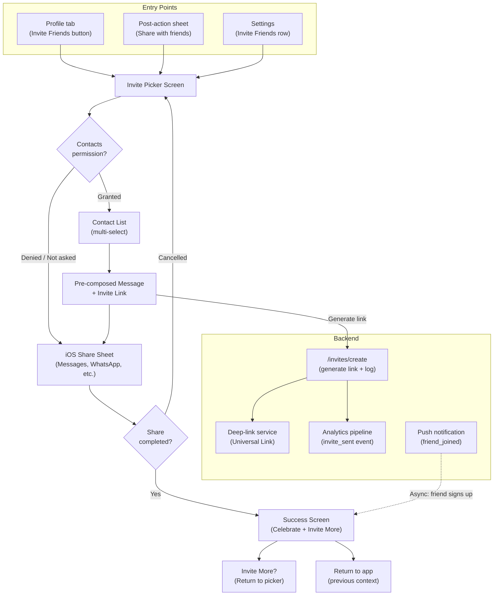

# Invite Friends Flow — Spec & Design Doc

## Artifact selection

**Selected:** Spec & Design Doc Pack **with Prototype Brief emphasis**

**Rationale:** This is a mobile consumer flow where "feel" is critical -- the invite experience lives or dies on permission timing, share-sheet friction, and the emotional moment of sending an invite. A prototype brief is needed to validate the riskiest interactions (contacts permission prompt timing, share-sheet configuration, and the post-invite feedback moment). The tap economy worksheet is essential given the explicit goal to optimize taps to first value.

---

## 0) Context snapshot

| Field | Detail |
|---|---|
| **Product** | Consumer iOS app (existing, with an active user base) |
| **Target user(s)** | Active users who have experienced core value and have social motivation to share (post-achievement, post-content-creation, or organic "tell a friend" moments) |
| **Problem + why now** | No dedicated invite flow exists. Users who want to share the app rely on copy-pasting App Store links or screenshots -- high friction, low conversion. Organic word-of-mouth is the top acquisition channel but has no product support. Adding a structured invite flow can amplify the existing viral signal before the next growth push. |
| **Decision to be made** | How should the invite flow work end-to-end (entry points, contact selection, channel, messaging, tracking)? **DRI:** Product Manager. **Approver:** Head of Product. |
| **Platforms** | iOS only (v1). Android follow-up if metrics justify. |
| **Constraints** | **Timeline:** 4 weeks to ship (2 weeks build, 1 week QA/polish, 1 week staged rollout). **Dependencies:** Push notification infrastructure (exists), deep-link service (exists or needs setup), contacts framework permission. **Policy/privacy:** Must comply with Apple contacts usage guidelines (purpose string, minimal data access, no server-side contacts storage in v1). |
| **Success metrics** | 1. **Invite send rate:** % of users who open the invite flow and successfully send at least 1 invite (target: >50%). 2. **Invite acceptance rate:** % of sent invites that result in the recipient installing + signing up (target: >15%). 3. **Inviter activation:** % of inviters who return to the app within 24h of sending an invite (target: >80%). |
| **Guardrails** | 1. No regression in app store rating (spam complaints). 2. Contacts permission grant rate stays above 60% (poor prompt timing = mass denials). 3. No increase in uninstall rate among invite recipients within 7 days. 4. Share-sheet completion rate (opened share sheet -> actually sent) > 70%. 5. P95 latency for invite link generation < 500ms. |

---

## 1) Goals / Non-goals / Out of scope

**Goals**
- G1: Enable users to invite friends via contacts, share sheet, or direct link with minimal friction.
- G2: Optimize the critical path so that a user can send their first invite in **3 taps or fewer** from the most common entry point.
- G3: Provide clear feedback on invite status (sent, accepted, reward) to reinforce the behavior loop.
- G4: Instrument the full funnel (impression -> open flow -> send -> accept -> sign up) for optimization.

**Non-goals**
- NG1: Incentive/reward system design (referral rewards are a separate initiative; the flow should have a placeholder hook but not implement reward logic in v1).
- NG2: Android support in this release.
- NG3: Server-side contacts matching or "find friends already on the app" (privacy-sensitive; deferred).
- NG4: In-app messaging / chat-based invites.

**Out of scope**
- OOS1: Referral attribution beyond first-touch (multi-touch attribution is a data platform concern).
- OOS2: A/B testing framework setup (use existing feature flag system).
- OOS3: Custom invite landing page design (use existing app install page; add deep link params only).
- OOS4: Bulk invite limits or anti-spam throttling beyond Apple's built-in share sheet constraints.

---

## 2) Assumptions + dependencies

**Assumptions**
- A1: Deep-link infrastructure (Universal Links) is available or can be set up within week 1. *(Owner: Mobile Platform team -- confirm by day 2.)*
- A2: The app already has a user identity system that can generate unique referral codes per user.
- A3: Users are most motivated to invite after a "value moment" (e.g., completing an action, achieving a milestone). Entry point placement will leverage these moments.
- A4: iOS share sheet (UIActivityViewController) is the primary send mechanism; we do not need to build custom channel integrations (iMessage, WhatsApp, etc.) in v1.
- A5: Push notifications to the inviter ("Your friend joined!") are supported by existing infra.

**Dependencies**
- D1: **Deep-link service** -- must support deferred deep links (recipient clicks link -> App Store -> opens app -> deep link resolves). *(Branch.io / Firebase Dynamic Links / custom.)*
- D2: **Analytics pipeline** -- invite events must flow to the existing event system with <1h latency for monitoring.
- D3: **App review** -- contacts permission purpose string must be reviewed by legal/privacy before submission.
- D4: **Backend endpoint** -- `/invites/create` and `/invites/status` APIs (new; estimated 3 days backend work).

---

## 3) Tap economy (mobile)

**First value event:** The inviter's friend receives a personalized invite message (the inviter feels "I did something").

**Tap budget target:** 3 taps from entry to first invite sent.

| Step | Screen / Action | Tap count | Cumulative | Friction risk | Tap removal ideas |
|---:|---|---:|---:|---|---|
| 1 | Tap "Invite Friends" button (profile / post-action sheet / settings) | 1 | 1 | Low -- button is visible in context | Place CTA at moment of highest motivation (post-achievement) |
| 2 | Contact picker: select 1+ contacts (or skip to share sheet) | 1 | 2 | **High** -- contacts permission prompt fires here on first use; denial = dead end | Pre-frame the permission with a half-sheet explainer *before* the system prompt; default to share-sheet path if permission denied |
| 3 | Tap "Send" on the share sheet (message pre-composed) | 1 | 3 | Medium -- user may edit message (adds taps but is optional) | Pre-fill a short, personalized message with the invite link; keep it editable but not required |
| -- | *(Success screen auto-shows)* | 0 | 3 | Low | Auto-dismiss after 2s or tap to dismiss |

**Tap removals applied:**
- Combined "select contact + preview message" into a single screen (eliminated a dedicated "compose" step).
- Pre-filled message removes the need to type anything.
- Share sheet is the native iOS mechanism -- no custom channel picker needed.
- If contacts permission is denied, fall back to share-sheet-only path (still 3 taps: entry -> share sheet -> send).

**Attention fragility points:**
- **Contacts permission prompt:** If the user denies, they cannot use the contact picker. The flow must gracefully degrade to the share-sheet path without a dead end.
- **App switching:** When the share sheet opens Messages/WhatsApp, the user leaves the app. The success state must persist so that when they return, they see confirmation (not a stale invite screen).
- **Post-send moment:** If the user returns to a blank screen, the loop breaks. Show a brief celebration + "invite more" affordance.

---

## 4) Low-fidelity diagram (moving pieces)



**Annotated decisions:**
1. **Single invite picker screen** (not separate flows per channel) -- reduces complexity and keeps tap count low.
2. **Contacts permission is optional** -- the flow works without it (share-sheet fallback). This avoids a hard gate.
3. **Pre-composed message** -- the invite link is generated *before* the share sheet opens, so the user sees a ready-to-send message.
4. **Deep-link generation is synchronous** -- must be fast (<500ms) or the share sheet feels laggy. Consider pre-generating the link when the invite screen loads.
5. **Success screen is the loop point** -- it reinforces the behavior and offers "invite more" before returning to the app.

---

## 5) User flows

### 5.1 Happy path (contacts permission granted)

```
1. User completes a value moment (e.g., finishes a session)
2. Post-action sheet appears: "Share with friends?" [Invite Friends] [Not now]
3. User taps [Invite Friends]
4. → Invite Picker Screen loads
   - System checks contacts permission status
   - Permission = .authorized → show contact list
   - Contact list loads (alphabetical, with search, multi-select)
5. User selects 1-3 contacts, taps [Next]
6. → Pre-composed message screen
   - Shows: "Hey [First Name], I've been using [App] and thought you'd love it! [invite-link]"
   - User can edit (optional)
   - Taps [Send via...] → iOS share sheet opens
7. User selects Messages, taps Send
8. → App resumes, Success Screen shows:
   - "Invite sent to [Name(s)]!" + animation
   - [Invite More Friends] [Done]
9. User taps [Done] → returns to previous screen
```

### 5.2 Happy path (contacts permission NOT granted -- fallback)

```
1-3. Same as above
4. → Invite Picker Screen loads
   - Permission = .denied or .notDetermined (user chose "skip")
   - Contact list is hidden; screen shows:
     - [Share Link] button (prominent)
     - "Allow contacts access for easier inviting" (secondary, links to Settings)
5. User taps [Share Link]
6. → iOS share sheet opens with pre-composed message + invite link
7. User selects a channel, sends
8. → Success Screen (same as above)
```

### 5.3 Edge cases

| # | Edge case | Trigger | Intended outcome |
|---|---|---|---|
| E1 | **First-time contacts permission** | User has never been asked for contacts access | Show a pre-permission explainer half-sheet ("We'll show your contacts so you can invite them. We never store or upload your contacts.") before triggering the system prompt. If denied, fall back to share-sheet path. |
| E2 | **Deep-link generation fails** | Network error or service timeout (>2s) | Show inline error: "Couldn't create your invite link. Check your connection and try again." Retry button. Do NOT open the share sheet with a broken link. |
| E3 | **User selects 10+ contacts** | Bulk selection | Allow up to 20 contacts per batch. Show a soft warning at 10: "Sending to many people at once? Consider a few personal invites instead." No hard block. |
| E4 | **Share sheet cancelled** | User opens share sheet but taps Cancel | Return to Invite Picker Screen (not the success screen). State is preserved (selected contacts remain selected). |
| E5 | **User re-enters invite flow** | User opens invite flow again after sending invites | Show previously invited contacts with "Invited" badge and timestamp. Allow re-inviting (no hard block). |
| E6 | **No network** | Device is offline when user enters invite flow | Show the invite picker (contacts are local). On [Send], generate the link. If offline, show: "You're offline. We'll send the invite when you're back online." Queue the invite for retry. |
| E7 | **Recipient already has the app** | Invite link clicked by existing user | Deep link resolves to a "welcome back" screen (not onboarding). Inviter still gets credit for the action. |
| E8 | **Push notification: friend joined** | Invited friend installs and signs up | Inviter receives push: "[Friend Name] joined [App]! Say hi." Tapping the notification opens the app to the friend's profile or a celebratory screen. |

---

## 6) States (per key screen)

### Invite Picker Screen

| State | Trigger | UI / Content | System behavior | Analytics event | Notes |
|---|---|---|---|---|---|
| **Loading** | Screen opens, contacts permission = granted | Spinner over contact list area; header and search bar visible | Fetch contacts from device (CNContactStore) | `invite_picker_opened` | Should resolve in <300ms for typical contact lists |
| **Empty (no contacts)** | Permission granted but device has 0 contacts | Illustration + "No contacts found. You can still share a link!" + [Share Link] button | No contact fetch needed | `invite_picker_empty_contacts` | Rare but must not be a dead end |
| **Populated** | Contacts loaded successfully | Alphabetical contact list with search, multi-select checkboxes, selected count badge on [Next] | Contacts stored in memory only (not uploaded) | `invite_picker_contacts_loaded` (count) | |
| **Permission denied** | Contacts permission = .denied or .restricted | [Share Link] button (prominent) + "Allow contacts access" secondary link (opens iOS Settings) | No contact fetch attempted | `invite_picker_permission_denied` | |
| **Permission not determined** | First time; pre-permission explainer shown | Half-sheet: illustration + "We'll show your contacts so you can invite them. We never store or upload them." + [Allow] / [Skip] | [Allow] triggers `CNContactStore.requestAccess`; [Skip] goes to share-sheet path | `invite_picker_permission_prompt_shown` | |
| **Error** | Contact fetch fails (rare; e.g., corrupted contacts DB) | "Something went wrong loading contacts. You can still share a link!" + [Share Link] + [Retry] | Log error to crash reporting | `invite_picker_error` | |

### Pre-composed Message Screen

| State | Trigger | UI / Content | System behavior | Analytics event | Notes |
|---|---|---|---|---|---|
| **Loading** | Screen opens; generating invite link | Message preview with placeholder shimmer where link will appear | POST `/invites/create` with user_id, contact_ids | `invite_link_generating` | Target: <500ms |
| **Ready** | Link generated successfully | Editable message: "Hey [Name], ..." with tapable invite link preview. [Send via...] button enabled | Link cached for session | `invite_link_ready` | |
| **Error** | Link generation fails | Inline error banner: "Couldn't create invite link. [Retry]" [Send via...] button disabled | Retry with exponential backoff (max 2 retries) | `invite_link_error` | |

### Success Screen

| State | Trigger | UI / Content | System behavior | Analytics event | Notes |
|---|---|---|---|---|---|
| **Invite sent** | Share sheet completed | Confetti animation + "Invite sent to [Name(s)]!" + [Invite More] + [Done] | Log invite_sent per recipient | `invite_sent` (count, channel) | Auto-dismiss after 5s if no interaction |
| **Friend joined (async)** | Push notification received | Updated badge on profile: "[Friend] joined!" | Deep link to friend's profile or celebration | `invite_accepted` | May happen hours/days later |

---

## 7) Prototype brief

### Decision to enable

Validate two critical interaction uncertainties before committing to build:
1. **Permission timing:** Does showing a pre-permission explainer before the system contacts prompt increase the grant rate compared to triggering the system prompt directly?
2. **Post-send moment:** Does a celebratory success screen with "Invite More" increase repeat invite behavior compared to a simple toast notification?

### Scenarios to prototype (3)

1. **Permission pre-frame flow:** User taps Invite Friends -> sees the explainer half-sheet -> taps Allow -> system prompt appears -> grants permission -> contacts load. Alternate: user taps Skip -> goes to share-sheet path.
2. **3-tap happy path:** User taps Invite Friends -> selects 2 contacts -> taps Send -> share sheet -> sends via Messages -> sees success screen with confetti.
3. **Denied-permission fallback:** User taps Invite Friends -> permission denied -> sees share-link-only screen -> taps Share Link -> share sheet -> sends -> success screen.

### Fidelity + tooling

- **Fidelity:** Hi-fi (in Figma or SwiftUI prototype). The "feel" of the permission explainer and success animation cannot be evaluated at low fidelity.
- **Tooling:** SwiftUI prototype preferred (runs on-device, real share sheet behavior). Figma prototype acceptable for the permission flow only.
- **Disposable:** Yes -- prototype code is throwaway. Production code will be built separately.

### Data realism

- Use 15-20 realistic contact names (not "John Doe 1, John Doe 2").
- Pre-composed message must use a real-looking invite link (e.g., `https://app.example.com/invite/abc123`).
- Success screen must show real names from the selection step.

### Timebox + reviewers

- **Timebox:** 3 days (start of week 1).
- **Reviewers:** Product Designer (lead), PM, 1 iOS engineer.
- **Review format:** 15-min walkthrough on a physical device (not screen share).

### Success criteria ("feel")

- **Permission grant rate in usability test:** >70% of test participants grant contacts permission after seeing the pre-frame explainer.
- **3-tap completion:** Participants complete the happy path in 3 taps without confusion or hesitation.
- **Repeat invite intent:** >50% of participants tap "Invite More" on the success screen (or express intent to invite more when asked).
- **Comprehension:** Participants can explain what happened to their invite ("it sent a message to my friend with a link") without prompting.

---

## 8) Requirements + acceptance criteria

| ID | Requirement | Priority | Acceptance criteria | Notes |
|---|---|---|---|---|
| R1 | The invite flow is accessible from at least 2 entry points: (a) profile tab, (b) post-action contextual prompt. | Must | Tapping the CTA from either entry point opens the Invite Picker Screen within 300ms. | Settings entry point is Should (R9). |
| R2 | The invite picker screen loads device contacts (with permission) and supports multi-select with search. | Must | Given contacts permission is granted, the contact list loads within 500ms for up to 5,000 contacts. User can search by name and select/deselect contacts. Selected count is visible. | Contacts are read-only and never uploaded. |
| R3 | A pre-permission explainer is shown before the iOS system contacts prompt on first access. | Must | On first invite flow entry where contacts permission is `.notDetermined`, a half-sheet appears explaining why contacts access is needed. Tapping "Allow" triggers the system prompt. Tapping "Skip" proceeds to the share-sheet-only path. | Copy must be reviewed by legal. |
| R4 | The invite flow works without contacts permission (share-sheet fallback). | Must | If contacts permission is denied/restricted/skipped, the Invite Picker Screen shows a prominent "Share Link" button. Tapping it opens the iOS share sheet with a pre-composed message and invite link. | No dead ends. |
| R5 | A unique, trackable invite link is generated per invite session. | Must | POST `/invites/create` returns a Universal Link within 500ms (P95). The link encodes: inviter_id, invite_session_id, timestamp. The link resolves correctly on iOS (direct open if app installed, App Store -> deferred deep link if not). | Deep-link service must support deferred deep links. |
| R6 | The pre-composed invite message is personalized and editable. | Must | Message includes the recipient's first name (if from contacts) and the invite link. User can edit the text before sending. Default message is under 160 characters (SMS-friendly). | |
| R7 | A success screen with celebration UI is shown after a completed share. | Must | After the share sheet completes, the Success Screen displays within 200ms, shows recipient name(s), a brief animation, and two CTAs: "Invite More Friends" and "Done". | |
| R8 | The full invite funnel is instrumented with analytics events. | Must | Events logged: `invite_flow_opened` (entry_point), `invite_picker_opened`, `invite_permission_prompt_shown`, `invite_permission_granted/denied`, `invite_contacts_selected` (count), `invite_link_generated`, `invite_share_sheet_opened` (channel), `invite_sent` (count, channel), `invite_share_cancelled`, `invite_accepted` (async). All events include user_id and session_id. | |
| R9 | The invite flow is accessible from Settings > "Invite Friends". | Should | A row in the Settings screen opens the Invite Picker Screen. | Lower-traffic entry point; include for completeness. |
| R10 | Previously invited contacts show an "Invited" badge with timestamp. | Should | On the Invite Picker Screen, contacts who were previously invited display a badge ("Invited 2d ago"). Re-inviting is allowed (no hard block). | Requires local persistence of invite history. |
| R11 | The inviter receives a push notification when an invited friend signs up. | Should | Within 5 minutes of the recipient signing up, the inviter receives a push: "[Friend Name] joined [App]!" Tapping the push opens the app. | Depends on existing push infra. |
| R12 | The invite flow is accessible in VoiceOver and supports Dynamic Type. | Must | All interactive elements have accessibility labels. The flow is navigable via VoiceOver. Text scales with Dynamic Type up to XXXL without layout breakage. | |
| R13 | Offline invite queueing: if the user is offline when sending, the invite is queued and sent when connectivity returns. | Could | If link generation fails due to no network, the app shows "We'll send this when you're back online" and retries automatically. The invite is sent within 30s of connectivity restoration. | May increase scope; evaluate in week 1. |
| R14 | Rate limiting: soft warning at 10 invites per session, no hard block. | Should | After selecting 10+ contacts, a non-blocking message appears: "Tip: personal invites work best. Send to a few close friends?" User can dismiss and continue. | Prevents spam perception without blocking power users. |
| R15 | The invite link expires after 30 days. | Must | Links older than 30 days redirect to the generic App Store page (not a broken page). | |

---

## 9) Measurement plan

| Metric / Guardrail | Definition | Data / Events needed | Owner | Cadence |
|---|---|---|---|---|
| **Invite flow open rate** | % of DAU who open the invite flow at least once per week | `invite_flow_opened` / DAU | Growth PM | Weekly |
| **Invite send rate** (primary) | % of users who open the flow and send >= 1 invite | `invite_sent` / `invite_flow_opened` (unique users) | Growth PM | Daily during rollout, weekly after |
| **Invite acceptance rate** (primary) | % of sent invites where recipient installs + signs up within 7 days | `invite_accepted` / `invite_sent` | Growth PM | Weekly |
| **Inviter return rate** (primary) | % of inviters who open the app within 24h of sending an invite | `app_opened` within 24h of `invite_sent` | Growth PM | Weekly |
| **Contacts permission grant rate** | % of users shown the pre-permission explainer who grant contacts access | `invite_permission_granted` / `invite_permission_prompt_shown` | Product Designer | Weekly |
| **Share sheet completion rate** (guardrail) | % of users who open the share sheet and complete the send action | `invite_sent` / `invite_share_sheet_opened` | Growth PM | Weekly |
| **Tap-to-value (instrumented)** | Median and P90 tap count from `invite_flow_opened` to `invite_sent` | Tap sequence logging on invite screens | iOS Engineer | Weekly |
| **Invite link latency** (guardrail) | P50 and P95 latency of `/invites/create` endpoint | Server-side latency metrics | Backend Engineer | Daily during rollout |
| **App Store rating** (guardrail) | No increase in 1-star reviews mentioning "spam" or "contacts" | App Store review monitoring (AppFollow or similar) | Growth PM | Weekly |
| **Uninstall rate among recipients** (guardrail) | 7-day uninstall rate of users acquired via invite vs. organic | Attribution data + uninstall events | Data Analyst | Bi-weekly |

---

## 10) Risks / Open questions / Next steps

### Risks

| # | Risk | Likelihood | Impact | Mitigation |
|---|---|---|---|---|
| R1 | **Contacts permission denial rate is high** (>50%), making the contact picker path underused. | Medium | Medium | Pre-permission explainer (R3); share-sheet fallback ensures the flow works without contacts (R4). Monitor grant rate in first week. |
| R2 | **Deep-link service setup takes longer than 2 days**, delaying invite link functionality. | Medium | High | Confirm deep-link provider choice by day 1. Have a fallback: plain URL with query params (less elegant but functional). |
| R3 | **Apple rejects the app update** due to contacts usage policy or purpose string wording. | Low | High | Get legal/privacy review of purpose string by end of week 1. Reference Apple's latest HIG for contacts usage. Submit for App Review early in week 3. |
| R4 | **Invite spam perception** damages brand or triggers negative reviews. | Low | Medium | Soft rate limiting (R14); personalized default message (not generic/spammy); no auto-send without user action. |
| R5 | **Share sheet behavior varies across iOS versions** (especially iOS 16 vs 17 vs 18 differences in UIActivityViewController). | Medium | Low | Test on iOS 16, 17, and 18 devices. Use standard UIActivityViewController APIs (avoid private APIs). |

### Open questions

| # | Question | Owner | Due by |
|---|---|---|---|
| Q1 | Which deep-link provider will we use (Branch / Firebase Dynamic Links / custom)? This affects link format, attribution, and deferred deep-link support. | Mobile Platform Lead | Day 2 |
| Q2 | Should the pre-composed message include the app name or keep it more personal/organic? Need to test copy variants. | Product Designer + Growth PM | End of prototype phase (day 3) |
| Q3 | Do we want to track which *channel* (Messages, WhatsApp, email, etc.) invites are sent through? UIActivityViewController provides limited channel info. | iOS Engineer | Day 5 |
| Q4 | Is there an existing referral code system, or do we need to build the invite-code generation from scratch? | Backend Engineer | Day 2 |
| Q5 | Should we include a placeholder reward hook in v1 UI (e.g., "Invite friends and earn rewards -- coming soon") or keep it clean? | Growth PM | Day 5 |
| Q6 | What is the maximum contact list size we should support in the picker before performance degrades? Need to test with 10k+ contacts. | iOS Engineer | End of week 1 |

### Next steps

| # | Action | Owner | Timeline |
|---|---|---|---|
| N1 | Confirm deep-link provider and set up Universal Links configuration. | Mobile Platform Lead | Days 1-2 |
| N2 | Build and test the hi-fi prototype (3 scenarios from prototype brief). | Product Designer + iOS Engineer | Days 1-3 |
| N3 | Review prototype with the team; decide on permission flow and success screen design. | PM + Designer + Eng | Day 4 |
| N4 | Legal/privacy review of contacts purpose string and invite message defaults. | PM + Legal | Days 3-5 |
| N5 | Backend: build `/invites/create` and `/invites/status` endpoints + analytics event pipeline. | Backend Engineer | Days 3-8 |
| N6 | iOS: build invite picker, share integration, success screen. | iOS Engineer | Days 5-12 |
| N7 | QA: test all flows (happy path, denied permission, offline, edge cases) on iOS 16/17/18. | QA | Days 13-17 |
| N8 | Staged rollout: 5% -> 25% -> 100% over days 18-25. Monitor invite send rate, permission grant rate, and guardrails. | Growth PM | Days 18-25 |
| N9 | Post-launch review (1 week after 100% rollout): review metrics, decide on Android timeline and reward system. | PM + Growth PM | Day 32 |

---

## Quality gate

### Checklist verification

| Checklist | Status | Notes |
|---|---|---|
| 1. Scope + decision clarity | Pass | Problem/why-now stated; goals/non-goals/OOS explicit; 3 success metrics + 5 guardrails defined; assumptions labeled with owners. |
| 2. Diagram quality | Pass | 9 moving pieces; shows entry points, permission branch, share sheet, success loop, and backend components. No pixel-level UI. |
| 3. Flows + states completeness | Pass | 2 happy paths (with/without contacts permission) + 8 edge cases. State tables for 3 key screens with all states (loading/empty/error/success). |
| 4. Prototype brief | Pass | Answers 2 specific decisions (permission timing, post-send moment). Hi-fi fidelity; 3-day timebox; realistic data; 4 measurable success criteria. Explicitly disposable. |
| 5. Mobile tap economy | Pass | 3-tap budget defined; tap worksheet with friction risks and removal ideas; attention fragility points documented. |
| 6. Testability + handoff | Pass | 15 requirements with MoSCoW priority and testable acceptance criteria. Non-functional: accessibility (R12), performance (R5 latency), privacy (R3, contacts not uploaded). Measurement plan with owners and cadence. |

### Rubric self-score

| Dimension | Score | Justification |
|---|---|---|
| 1. Scope clarity | 5 | Crisp goals/non-goals/OOS; explicit tradeoffs (v1 boundaries); assumptions have owners and due dates. |
| 2. Diagram usefulness | 4 | 9 moving pieces with clear flow; backend components shown; minor: channel-specific behavior in share sheet could be more detailed (intentionally deferred -- Apple controls this). |
| 3. Flows + state coverage | 5 | 2 happy paths are role-playable; 8 edge cases with intended outcomes; 3 state tables with all states and analytics events. |
| 4. Prototype plan quality | 5 | 2 clear decisions; hi-fi fidelity justified; realistic data spec; 4 measurable success criteria; explicitly disposable. |
| 5. Testability | 5 | 15 requirements with MoSCoW and testable acceptance criteria; non-functional needs (a11y, performance, privacy) covered; edge cases in ACs. |
| 6. Measurement + risk management | 5 | 10 metrics/guardrails with data sources, owners, and cadence; 5 risks with likelihood/impact/mitigation; 6 open questions with owners and due dates; 9 next steps with timeline. |

**Total: 29/30** -- Exceeds ship-ready threshold (24/30). No category below 3.
